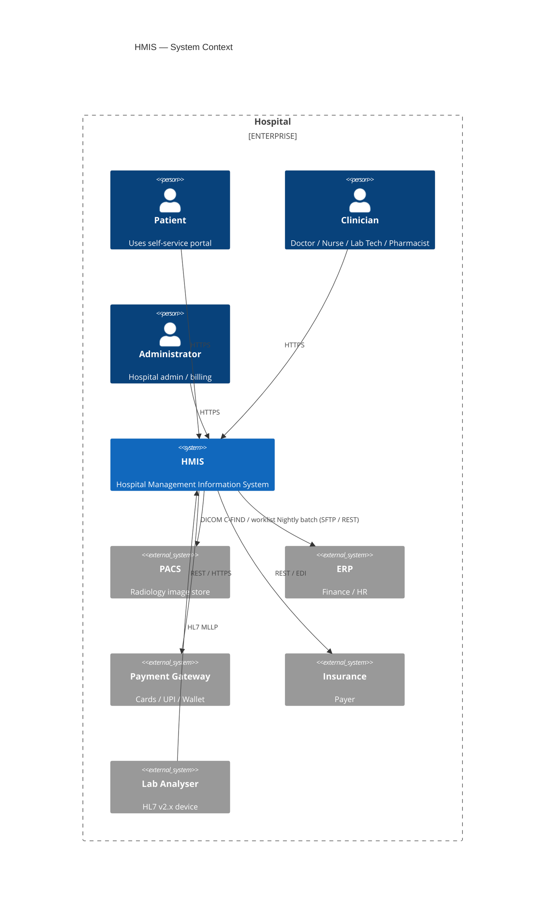
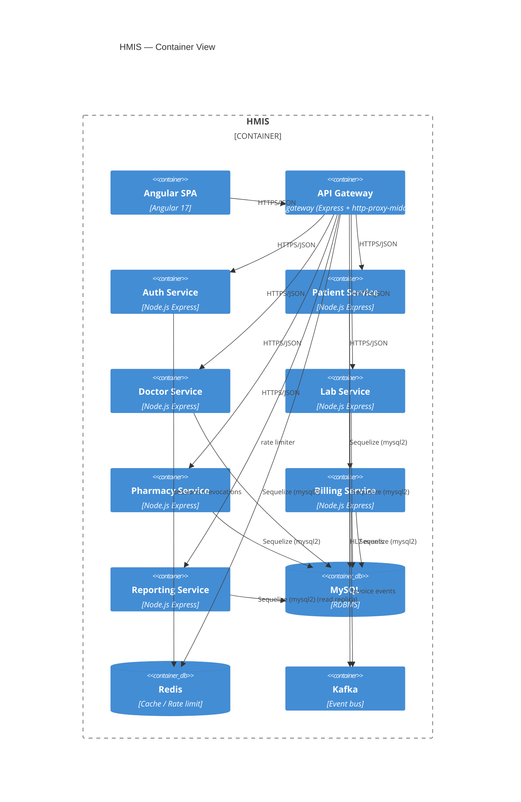
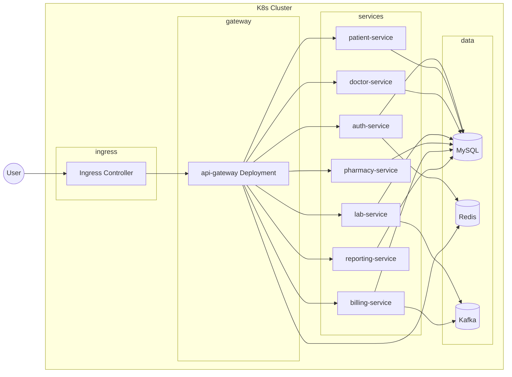
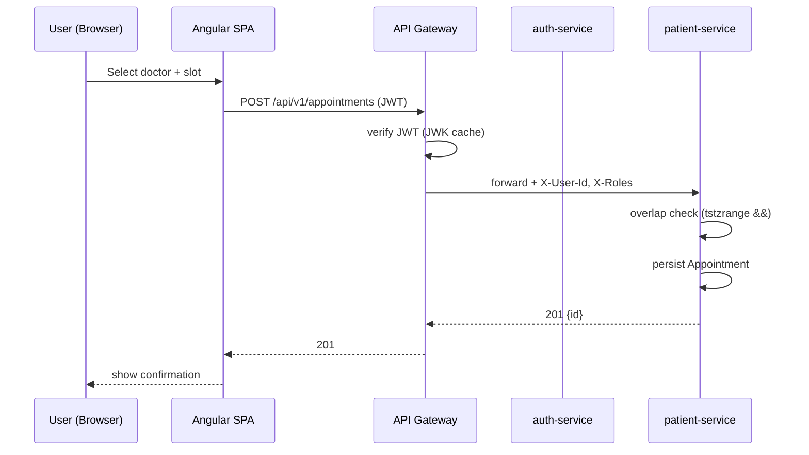
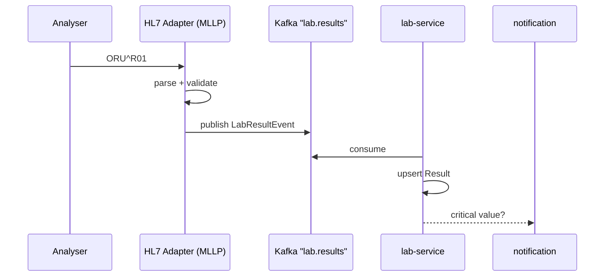
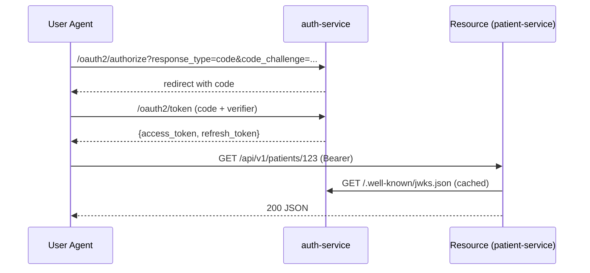
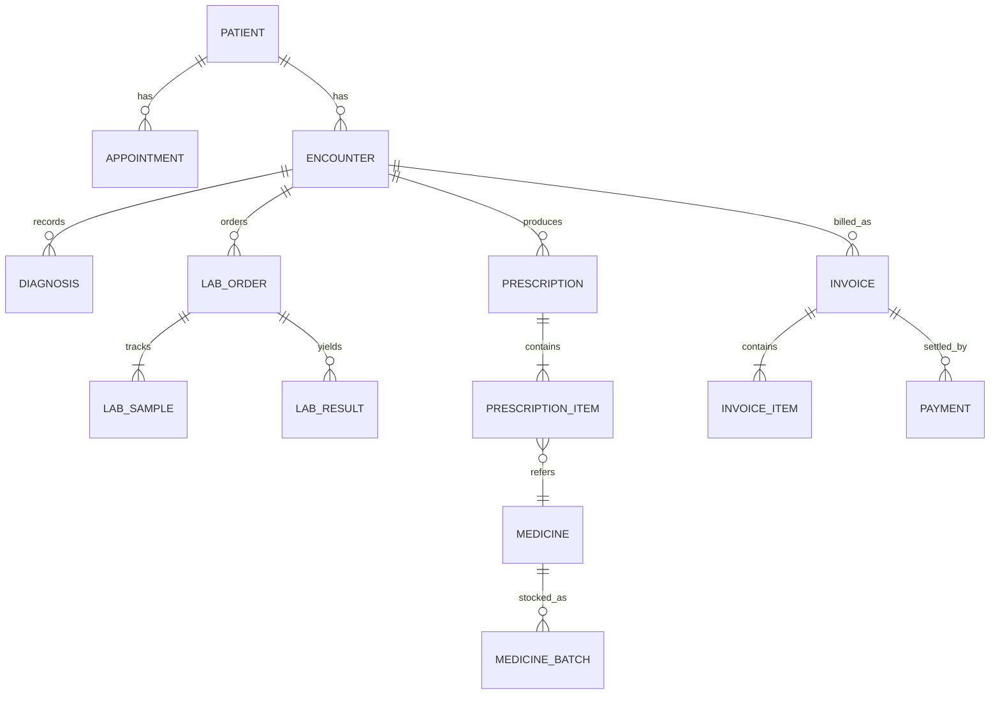

# Architecture Diagrams — HMIS

All diagrams are expressed in Mermaid for tooling portability.

## 1. C4 — Context

## 2. C4 — Container

## 3. Deployment (Kubernetes)

## 4. Data Flow — Appointment Booking

## 5. HL7 Result Ingest

## 6. Security Flow — OAuth2 + PKCE

## 7. Logical Data Model (ER overview)

